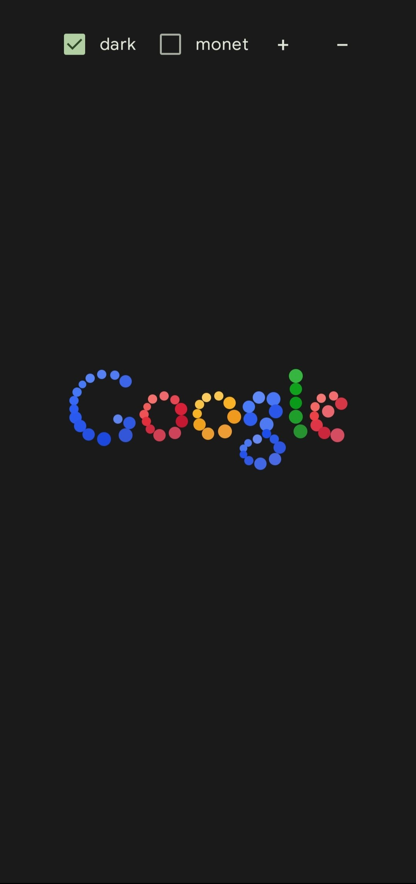

# google balls app!!!

google balls!! that one doodle from 2010! for android 6 and newer with dynamic color and material 3!

https://github.com/user-attachments/assets/59469b97-d8c2-4446-8d83-b97b5a44e904
<!-- i tried to embed the video in images/yji9l9.mp4 but it didnt work but the video is still there -->
presntation made by @GattoDev-debug

# Credits!
Google for making the original doodle back in 2010!

[Rob Hawkes](https://github.com/robhawkes) for making the remake of the doodle that this project uses as a base!

[weeniemount](https://github.com/weeniemount) for making original app for android

btw be sure to check out https://github.com/weeniemount/googleballs-app/tree/master/android

**this project isnt affiliated with google**
